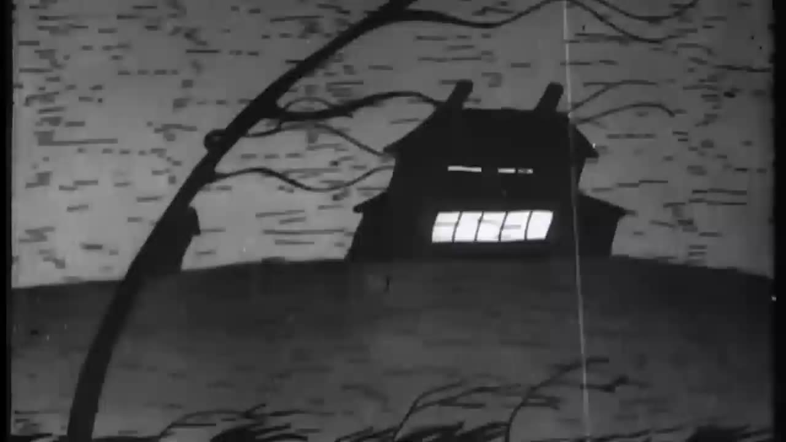

# VideoRasterization

VideoRasterization is an AI-assisted grayscale-to-color video pipeline built as a graduation project. It takes an old grayscale or black-and-white video, extracts frames, colorizes them with a selected backend, optionally stabilizes color across time, and rebuilds the final video with audio preserved when available.

This repository is the final archived project state. It includes the full runnable pipeline, the desktop GUI, multiple model backends, custom ChromaNet training code, benchmark helpers, and project documentation.

## Highlights

- End-to-end video workflow from input video to final colorized output
- Interactive CLI pipeline and desktop GUI
- Multiple AI colorization backends under one shared interface
- Custom ChromaNet integration with local training code
- Exact duplicate-frame skipping before inference
- Optional temporal smoothing with motion-aware `flow_chroma`
- Full-resolution luminance preservation for sharper output
- Audio-safe final reconstruction with FFmpeg
- Archived checkpoints layout and project documentation

## Preview

### Desktop GUI



### System Architecture


### Temporal Smoothing


## What The Project Does

At runtime, VideoRasterization follows this flow:

1. Select a grayscale video.
2. Extract frames into a working directory.
3. Skip exact duplicate frames when possible.
4. Colorize unique frames using the selected AI backend.
5. Restore skipped duplicates.
6. Optionally apply temporal smoothing for color consistency.
7. Generate a preview report.
8. Rebuild the final MP4 and restore source audio if present.

## Supported Backends

| Backend | Role in project | Notes |
| --- | --- | --- |
| `colorize_chromanet_v3` | Custom graduation-project model path | Main academic model, integrated with local training code |
| `instcolorization2025` | Extended and modernized project fork | Used as an additional image/video colorization backend |
| `colorize_zhang` | Legacy baseline | Supports `eccv16` and `siggraph17` |
| `Enhanced Zhang (Bebo's Experiment)` | Improved practical baseline | Repo-side enhancement layer over Zhang weights |

## Key Features

### Video-first pipeline

- built around real video input and output, not only single-image demos
- preserves frame order, output resolution, and source audio when available
- includes preview and reporting helpers for quick validation

### Duplicate-frame skipping

- exact consecutive duplicates are skipped before model inference
- duplicate outputs are restored after colorization
- helps on still scenes, title cards, and low-motion footage

### Sharper output path

- ChromaNet and InstColorization preserve the original full-resolution luminance
- only predicted chroma is upscaled
- avoids the worst “stretched 256x256 frame” look common in naive colorization adapters

### Temporal smoothing

- `flow_chroma`: motion-aware chroma stabilization using optical flow
- `legacy_average`: older sliding-window averaging mode

`flow_chroma` is the preferred option for actual video playback because it preserves luminance and stabilizes color without relying on full-frame blur averaging.

## Repository Layout

```text
VideoRasterization/
  main.py                                # interactive CLI entrypoint
  VideoRasterization.bat                 # GUI launcher
  requirements.txt
  gui/
    app.py                               # desktop GUI host
    src/
  video_pipeline/                        # extraction, smoothing, reporting, rebuild flow
  tools/
    AImodels/                            # model adapters
    FFmpeg/                              # FFmpeg helpers
    TemporalSmoothing/                   # smoothing implementation
  checkpoints/                           # centralized local model weights
  ChromaNet_v3_complete/chromanet_v3/    # custom ChromaNet training/inference code
  docs/                                  # checkpoint notes and training notes
  reports/                               # technical report, proposal, presentations, diagrams
  Videos/                                # local video samples (ignored by git)
  temp/                                  # working directory for extracted frames (kept empty in archive)
```

## Requirements

- Windows
- Python `3.11`
- NVIDIA GPU recommended for the best experience
- PyTorch CUDA build for ChromaNet and InstColorization acceleration

Project dependencies:

```text
torch
imageio-ffmpeg
numpy
scikit-image
matplotlib
opencv-python
Pillow
ipython
pywebview
psutil
```

## Setup

Install PyTorch with CUDA:

```powershell
& "$env:LOCALAPPDATA\Programs\Python\Python311\python.exe" -m pip install torch torchvision --index-url https://download.pytorch.org/whl/cu121
```

Install project dependencies:

```powershell
& "$env:LOCALAPPDATA\Programs\Python\Python311\python.exe" -m pip install -r requirements.txt
```

Quick CUDA check:

```powershell
& "$env:LOCALAPPDATA\Programs\Python\Python311\python.exe" -c "import torch; print(torch.cuda.is_available()); print(torch.cuda.get_device_name(0))"
```

## Run The Project

### CLI pipeline

```powershell
& "$env:LOCALAPPDATA\Programs\Python\Python311\python.exe" .\main.py
```

### Desktop GUI

```powershell
& "$env:LOCALAPPDATA\Programs\Python\Python311\python.exe" .\gui\app.py
```

or:

```powershell
.\VideoRasterization.bat
```

## Typical Workflow

The CLI asks for:

1. input video path
2. extraction mode
3. AI backend
4. model-specific options
5. temporal smoothing mode

Recommended practical choices:

- Extraction mode: `2` for faster JPG extraction
- Backend: `colorize_chromanet_v3` or `Enhanced Zhang (Bebo's Experiment)`
- Temporal smoothing: `flow_chroma`

## Checkpoints

All local model weights are organized under:

```text
checkpoints/
  chromanet/
  instcolorization/
  zhang/
```

Important note for archived ChromaNet behavior:

- `checkpoints/chromanet/checkpoint_epoch007.pth` is the preferred default checkpoint
- `checkpoints/chromanet/checkpoint_latest.pth` is still kept for compatibility
- in the archived repo state, `checkpoint_latest.pth` currently matches epoch 7

Additional note:

- [checkpoints/chromanet/CHECKPOINT_NOTE.md](checkpoints/chromanet/CHECKPOINT_NOTE.md)

Checkpoint reference docs:

- [docs/checkpoints/README.md](docs/checkpoints/README.md)
- [docs/checkpoints/chromanet.md](docs/checkpoints/chromanet.md)
- [docs/checkpoints/instcolorization.md](docs/checkpoints/instcolorization.md)
- [docs/checkpoints/zhang.md](docs/checkpoints/zhang.md)

## ChromaNet Training

ChromaNet training code lives under:

- [train.py](ChromaNet_v3_complete/chromanet_v3/train.py)
- [default.yaml](ChromaNet_v3_complete/chromanet_v3/configs/default.yaml)

Current archived configuration is a fine-tuning-oriented setup and may be adjusted depending on hardware and dataset availability.

Start or resume training:

```powershell
cd .\ChromaNet_v3_complete\chromanet_v3
& "$env:LOCALAPPDATA\Programs\Python\Python311\python.exe" -u train.py --config configs/default.yaml --resume latest
```

Run with a time limit:

```powershell
& "$env:LOCALAPPDATA\Programs\Python\Python311\python.exe" -u train.py `
  --config configs/default.yaml `
  --resume latest `
  --max-hours 3 `
  2>&1 | Tee-Object -FilePath training.log
```

Dataset notes:

- [docs/training_datasets.md](docs/training_datasets.md)
- [TrainingData/README.md](TrainingData/README.md)

## Documentation And Artifacts

Technical report and project material:

- [Documentation Report-SecondTerm.md](reports/Documentation%20Report-SecondTerm.md)
- [Documentation Report-SecondTerm.docx](reports/Documentation%20Report-SecondTerm.docx)
- [Documentation Report-FirstTerm.pdf](reports/Documentation%20Report-FirstTerm.pdf)
- [Graduation_Project_Proposal.md](reports/Graduation_Project_Proposal.md)
- [VideoRasterization_SecondTerm_Presentation.pptx](reports/VideoRasterization_SecondTerm_Presentation.pptx)

Useful diagrams:

- 
- 
- 

## Known Limitations

- grayscale-to-color restoration is inherently ambiguous
- weak checkpoints can produce gray, beige, or low-confidence colors
- old stylized footage can fail harder than ordinary grayscale conversions
- color boundaries are still limited by model quality and effective inference resolution
- `legacy_average` smoothing may smear motion

## Status

This repository is finalized as the archived graduation-project state.

It is intended to preserve:

- the runnable pipeline
- the custom ChromaNet path
- the benchmark and documentation material
- the final checkpoint conventions
- the GUI and CLI entrypoints used during the project

## License / Notes

This repository contains project code and documentation, but large model checkpoints, datasets, generated reports, and local videos are intentionally kept outside version control.

If you want to reproduce full training or final demo outputs, you will need the corresponding local checkpoints and datasets placed in the expected folders.
